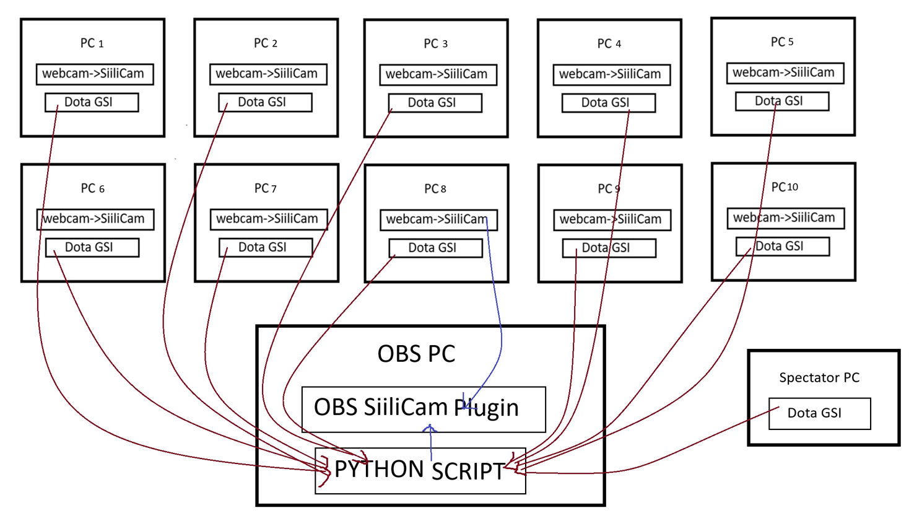

# Tournament setup using siilicams

Idea is that we switch OBS camera based on which player the spectator is spectating.
Players are mapped based on their steamid to the PC they are currently using
different dota GSI configurations and Siilicam Receiver configurations on different pcs.

## Setup
Image of the setup for DOTA tournament



There is 10 PC:s and each pc will send dota GSI data to specific url to this python server
and spectator machine as well. Then this python script will decide which computers
webcam to show. This needs an additional application which turns your WebCam into SiiliCamera which is going to be published in microsoft store soon. In SiiliCam-receiver
all pcs must have their mdns-name set as `pcx` and the same `x`  is the id which dota gsi sends data to.

my path for the gsi is at

`D:\SteamLibrary\steamapps\common\dota 2 beta\game\dota\cfg\gamestate_integration`

Spectator setup for spectator machine
```
"Dota 2 GSI Configuration"
{
    "uri" "http://127.0.0.1:6043/spectator"
    "timeout" "5.0"
    "buffer"  "0.1"
    "throttle" "0.1"
    "heartbeat" "30.0"
    "data"
    {
        "hero"            "1"
        "player"          "1"
    }
}
```

pc setup for each gaming pc

```
"Dota 2 GSI Configuration"
{
    "uri" "http://127.0.0.1:6043/pc?pcId=x"
    "timeout" "5.0"
    "buffer"  "0.1"
    "throttle" "1"
    "heartbeat" "30.0"
    "data"
    {
        "player"              "1"
    }
}
```
where `x` is the pc id, for our setup it ranges from [0,9]